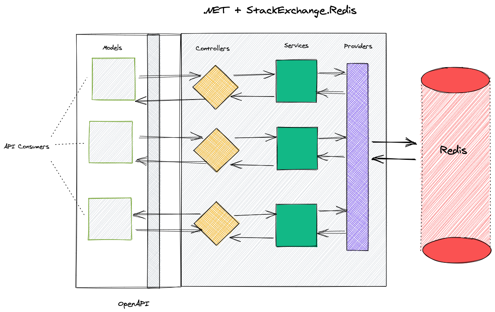

# NRedi2Read-Preview
## A Redis + .NET Coding Adventure



A collection of .NET REST services for a mythical online bookstore powered by Redis. It uses:

* [StackExchange.Redis](https://stackexchange.github.io/StackExchange.Redis/)
* [RediSearch](https://oss.redislabs.com/redisearch/) via [NRediSearch](https://stackexchange.github.io/StackExchange.Redis/)
* [RedisJSON](https://oss.redislabs.com/redisjson/) via [NReJSON](https://github.com/tombatron/NReJSON)

**Prerequisites:**

* [.NET 5](https://dotnet.microsoft.com/download/dotnet/5.0)
* [Docker](https://docs.docker.com/get-docker/)
* [Docker Compose](https://docs.docker.com/compose/install/)

## | [Getting Started](#getting-started) | [See Also](#see-also) | [Help](#help) | [License](#license) | [Credit](#credit) |

## Getting Started

### Clone the Repository w/ Submodules

To install this example application, run the following commands:
```bash
git clone git@github.com:redis-developer/NRedi2Read-preview.git
cd NRedi2Read-preview
```

You can also import the code straight into your IDE:
* [Visual Studio Code](https://code.visualstudio.com/docs/languages/csharp)
* [JetBrains Rider](https://www.jetbrains.com/help/rider/Creating_and_Opening_Projects_and_Solutions.html)

### Start Redis and the .NET Application

Set the environment secrets
```bash
dotnet user-secrets init
dotnet user-secrets set CacheConnection "localhost,abortConnect=false,ssl=false,allowAdmin=false,password="
```

#### Optional Configuration setup
The User API uses the [BCRYPT](https://en.wikipedia.org/wiki/Bcrypt) algorithm to hash its passwords. This app will also bulk-load 1000 users when it starts up (if they are not already in the database). Because of these two pieces in conjunction starting up can take a while (a couple minutes) the first time the server is started up, unless you artificially decrease the amount of work the BCRYPT algorithm has to do. If you are only using the stuff in here for demonstration purposes you can decrease the amount of work the BCRYPT algorithm does by setting the `BCryptWorkFactor` configuration variable you can do that locally with:

```bash
dotnet user-secrets set "BCryptWorkFactor" "4"
```

Start up Docker:
 ```bash
 docker run -p 6379:6379 -it --rm redislabs/redismod:edge
 ```

Start the app (in separate shell)
```bash
dotnet run
```

You can then access the UI at [http://localhost:5000/](http://localhost:5000/?#)

You can either make your own user profile, or login using one of the profiles from `/redi2read-data/users/users.json`

Access the Swashbuckle/Swagger UI:
[http://localhost:5001/swagger/index.html](https://localhost:5001/swagger/index.html)

## See Also

Quick Tutorial on Redis' Powerful Modules:

* [RedisJSON Tutorial](https://developer.redislabs.com/howtos/redisjson)
* [RediSearch Tutorial](https://developer.redislabs.com/howtos/redisearch)

## Help

Please post any questions and comments on the [Redis Discord Server](https://discord.gg/redis),
and remember to visit our [Redis Developer Page](https://developer.redislabs.com) for awesome tutorials,
project and tips.

## License

[MIT Licence](http://www.opensource.org/licenses/mit-license.html)

## Credit

- [DaShaun Carter](https://github.com/dashaun) @ [Redis Labs](https://redislabs.com)
- [Guy Royse](https://github.com/guyroyse) @ [Redis Labs](https://redislabs.com)
- [Steve Lorello](https://github.com/slorello89) @ [Redis Labs](https://redislabs.com)